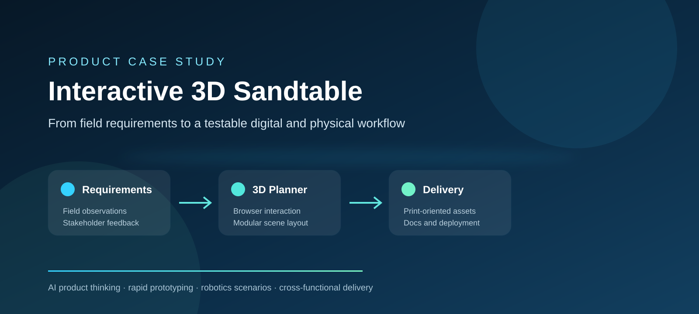

# Interactive 3D Sandtable Starter

> 一个可交互、可复制、已脱敏的浏览器 3D 沙盘系统模板。源自真实机器人测试场景项目的方法与交互设计，不包含企业私有模型、数据或内部资料。

[🚀 在线观赏与操作](https://sandtable-3d-starter.jihongwei1217.chatgpt.site) · [🍴 复制一份（Fork）](https://github.com/jihongwei1217-code/interactive-3d-sandtable-portfolio/fork) · [⬇ 下载全部源码](https://github.com/jihongwei1217-code/interactive-3d-sandtable-portfolio/archive/refs/heads/main.zip) · [📘 中文项目案例](CASE_STUDY_CN.md)



## 这次公开的不是介绍页

仓库现在同时包含两部分：

1. **能直接操作的在线演示**：打开上面的“在线观赏与操作”，无需安装软件。
2. **能复制修改的完整模板源码**：Fork 或下载后，可以换成自己的场景、颜色、模块和文案。

公开模板包含：

- 5 类通用场景模块：机器人代理、测试工作台、信息看板、景观绿植、操作人员；
- 室内、室外、混合三种场景模板；
- 点击添加与画布拖动；
- 选中、删除、撤回；
- 3D / 2D 俯视切换；
- 本地保存与恢复；
- JSON 布局导入、导出；
- 桌面端和移动端自适应界面。

## 快速复制

### 方法 A：直接 Fork

点击页面顶部的 **“复制一份（Fork）”**。GitHub 会在你的账号下创建完整副本，之后可自由修改。

### 方法 B：下载 ZIP

点击 **“下载全部源码”**，解压后在项目目录运行：

```bash
npm install
npm run dev
```

浏览器打开终端显示的本地地址即可。

### 方法 C：Git 克隆

```bash
git clone https://github.com/jihongwei1217-code/interactive-3d-sandtable-portfolio.git
cd interactive-3d-sandtable-portfolio
npm install
npm run dev
```

## 从哪里开始改

- `app/page.tsx`：场景模块、模板数据、拖动、删除、撤回、保存和导入导出逻辑。
- `app/globals.css`：整个界面的视觉风格、3D 透视和响应式布局。
- `app/layout.tsx`：页面标题与网站说明。
- `public/`：图标等公开静态资源。

模块数据位于 `app/page.tsx` 顶部的 `assetInfo` 和 `templates`。替换这些数据即可快速做出一套自己的沙盘系统。

## 作品背景

原项目探索了如何把真实机器人测试环境转化为浏览器中的交互式数字沙盘，并连接模型浏览、场景规划、版本迭代、打印交付与说明文档。

我在项目中承担产品负责人和 AI 辅助原型协调角色，主要工作包括：

- 将照片、现场观察和反馈转化为产品需求；
- 设计 3D 资产库、场景规划与交付导航的信息架构；
- 推动拖拽、删除、撤回、视角恢复、历史记录和模块化场景等交互；
- 协调浏览器预览、可打印资产、装配文档与部署；
- 使用 AI 加速原型、界面迭代、文档整理和交付；
- 进行持续的视觉与可用性检查。

详见 [中文项目案例](CASE_STUDY_CN.md) 和 [公开披露边界](PUBLIC_DISCLOSURE.md)。

## 技术说明

- React + TypeScript
- Vinext / Vite
- 纯 CSS 透视场景，无需下载大型 3D 模型
- 浏览器 LocalStorage
- JSON 文件导入导出

## 公开边界

本仓库中的交互模板使用通用几何模块重新实现，不包含：

- 企业专有 STL、STP、GLB 或生产模型；
- 内部照片、尺寸、场地布局；
- 客户或公司机密数据；
- 部署密钥和内部文档；
- 受限制或安全敏感资料。

公开模板代码使用 [MIT License](LICENSE)。案例文字和企业私有资产不因本模板开源而获得授权。

---

如果你是黑客松评审：建议先点 **“在线观赏与操作”**，再查看本仓库的产品思路与源码。
